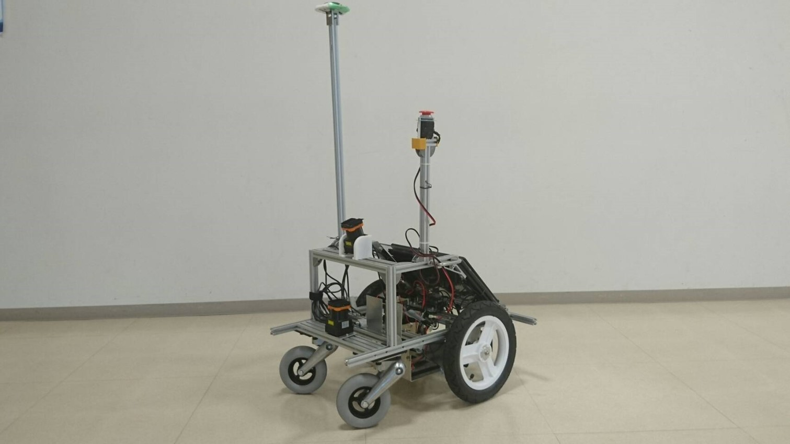

orne_navigation
=================

This repository provides mobile navigation system for Tsukuba Challenge under Project ORNE.

## Dependency Repositories

* https://github.com/open-rdc/icart_mini

* https://github.com/open-rdc/cit_adis_imu

* https://github.com/open-rdc/orne_maps

* https://github.com/open-rdc/orne_icart_designs

* https://github.com/DaikiMaekawa/fulanghua_navigation

* https://github.com/DaikiMaekawa/ypspur

## Install

Install ROS software (we recommend ROS indigo version with Ubuntu 16.04LTS) at http://wiki.ros.org/kinetic/Installation, please select the Ubuntu platform.

- [Install guide (Japanese)](https://github.com/open-rdc/orne_navigation/wiki/ORNE%E7%92%B0%E5%A2%83%E3%81%AE%E6%A7%8B%E7%AF%89%E3%81%AB%E3%81%A4%E3%81%84%E3%81%A6)
- [Install guide (English)](https://github.com/open-rdc/orne_navigation/wiki/Install_ORNE_pkg)

## Operation

- [Operation guide (Japanese)](https://github.com/open-rdc/orne_navigation/wiki/ORNE%E7%92%B0%E5%A2%83%E5%8B%95%E4%BD%9C%E3%81%AE%E6%89%8B%E9%A0%86)
- [Operation guide (English)](https://github.com/open-rdc/orne_navigation/wiki/How_to_operate)

## Bugs & Tasks

https://github.com/open-rdc/orne_navigation/issues

## License

Copyright (c) 2014 - 2015, [Daiki Maekawa](https://github.com/DaikiMaekawa) and Chiba Institute of Technology.

License-check is open source software under the [BSD license](https://github.com/open-rdc/icart_mini_ros_pkgs/blob/master/LICENSE).
