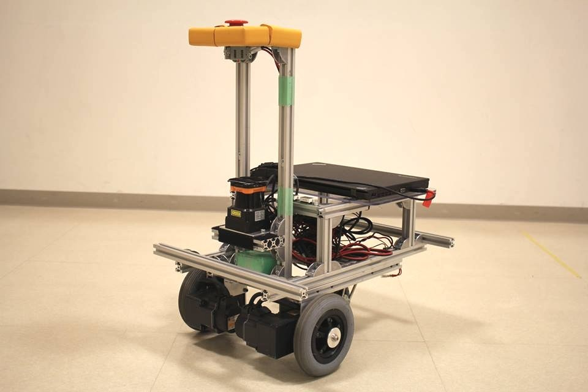

orne_navigation
=================

[](https://gitter.im/open-rdc/orne_navigation?utm_source=badge&utm_medium=badge&utm_campaign=pr-badge&utm_content=badge)

This repository provides mobile navigation system with i-Cart mini for Tsukuba Challenge under Project ORNE. 

[](https://waffle.io/open-rdc/tsukubachallenge/metrics) 



## Dependency Repositories

* https://github.com/open-rdc/icart_mini

* https://github.com/open-rdc/cit_adis_imu

* https://github.com/open-rdc/orne_maps

* https://github.com/open-rdc/orne_icart_designs

* https://github.com/DaikiMaekawa/fulanghua_navigation

* https://github.com/DaikiMaekawa/ypspur

## Install

Install ROS software (we recommend ROS indigo version with Ubuntu 14.04LTS) at http://wiki.ros.org/indigo/Installation, please select the Ubuntu platform.

* Preparation of python-catkin-tools

```sh
$ sudo sh -c 'echo "deb http://packages.ros.org/ros/ubuntu `lsb_release -sc` main" > /etc/apt/sources.list.d/ros-latest.list'
$ wget http://packages.ros.org/ros.key -O - | sudo apt-key add -
$ sudo apt-get update
$ sudo apt-get install python-catkin-tools
```

* Preparation of ORNE packages

```sh
$ mkdir -p catkin_ws/src
$ cd catkin_ws/src
$ catkin_init_workspace
$ cd ../
$ catkin build
$ git clone https://github.com/DaikiMaekawa/ypspur.git
$ wstool init
$ wstool merge https://raw.githubusercontent.com/open-rdc/orne_navigation/indigo-devel/orne_pkgs.install
$ wstool up
$ rosdep install --from-paths . --ignore-src --rosdistro $ROS_DISTRO -y
$ catkin build
```

## Usage

### Setting(First time only)

```sh
$ rosrun orne_setup create_robot_params
$ rosrun orne_setup create_udev_rules
```

### Bring up the real/simulated robot

The following will show the commands needed to bring up either real or simulated robots.

* Bring up the simulated robot

```sh
$ roslaunch orne_bringup orne_alpha_sim.launch // or orne_beta_sim.launch
```

* Bring up the real robot

```sh
$ roslaunch orne_bringup orne_alpha.launch // or orne_beta.launch
```

### Build map

```sh
$ roslaunch orne_navigation_executor  build_map_teleop.launch
```


If you want to save a map, run the map_saver node like the following command.

```sh
$ rosrun map_server map_saver -f filename
```

Since a cost map is required when performing self-positioning, if you haven't created a cost map other than walls, create a cost map with the following command
```sh
$ cp filename.yaml filename_for_costmap.yaml
```


### Record the waypoints

* Using the PublishPoint message on the RViz

```sh
$ roslaunch orne_navigation_executor  record_waypoints_viz.launch map_file:=filename
```

* Using a joystick

While running, waypoints are recorded by pressing the No.1 or □ button of the joystick.
When you set 2DNavGoal at the goal point on the RViz, waypoints will be saved and then the waypoints file stored in orne_navigation/waypoints_cfg/waypoints.yaml will be overwritten. So that, the navigation system can be automatically loaded  with the waypoints configuration.
```sh
$ roslaunch orne_navigation_executor  record_waypoints_joy_{alpha/beta}.launch map_file:=filename
```

Note that filename must be specified in the full path.

### Navigation

* Waypoint Navigation

```sh
$ roslaunch orne_navigation_executor  play_waypoints_nav_{alpha/beta}.launch
```

* Waypoint Navigation with an optional map file

```sh
$ roslaunch orne_navigation_executor  play_waypoints_nav_{alpha/beta}.launch map_file:=filename
```

* Waypoint Navigation with optional waypoints file

```sh 
$ roslaunch orne_navigation_executor  play_waypoints_nav_{alpha/beta}.launch waypoints_file:=filename.yaml
```

A map name and waypoints file must be specified in the full path.

* Enable the starting flag

Click "StartWaypointsNavigation" button on Rviz

* Run the navigation system with a static map

```sh
$ roslaunch orne_navigation_executor  nav_static_map.launch robot_name:={alpha/beta} map_file:=filename.yaml
```

Don't forget to turn off the teleoperation, it might interfere with the robot's commands.

## Bugs & Tasks

https://github.com/open-rdc/orne_navigation/issues

## License


Copyright (c) 2014 - 2015, [Daiki Maekawa](https://github.com/DaikiMaekawa) and Chiba Institute of Technology.

License-check is open source software under the [BSD license](https://github.com/open-rdc/icart_mini_ros_pkgs/blob/master/LICENSE).
